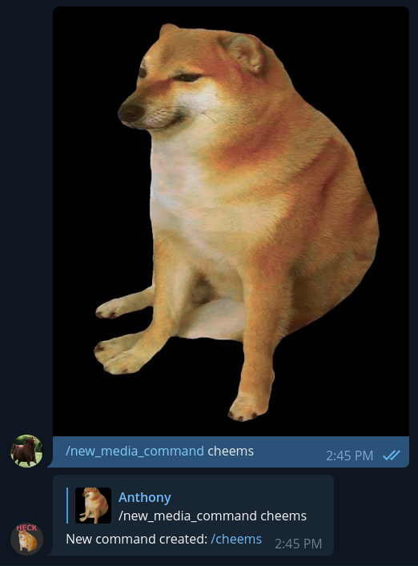

# degen-bot 

## Telegram Cryptocurrency Bot

A Telegram bot designed to provide information and price notifications for cryptocurrencies.

# Table of Contents

* [Setup](#setup)
    * [Environment File](#environment-file)
    * [Cryptocurrency JSON File](#cryptocurrency-json-file)
    * [Telegram Bot Setup](#telegram-bot-setup)
* [General Commands](#general-commands)
* [Price Notification Commands](#price-notification-commands)
* [Misc Commands](#misc-commands)

# Setup

## Environment File

`.env` file contains the api keys to retrieve cryptocurrency info and to connect to the telegram API.
This file is not included in the project. You will need to make it yourself.

- Telegram: https://core.telegram.org/api/obtaining_api_id
- CoinMarketCap: https://coinmarketcap.com/api/
- Etherscan: https://info.etherscan.com/api-keys/

Telegram users can obtain their user ID from this [bot](https://botostore.com/c/getmyid_bot/). This ID is used to designate admins.

### Sample .env

```.env
TELEGRAM_API_KEY = XXXXXX
COINMARKETCAP_API_KEY = XXXXXX
ETHERSCAN_API_KEY = XXXXXX

ADMIN_IDS = [1, 2, 3]
```

## Cryptocurrency JSON File

### cryptos.json format
```json
"COIN_SYMBOL": {
    "INFO": {
        "contract_id": "0xCONTRACT_ID",
        "chain": "CHAIN",
        "website": "WEBSITE"
    },
    "cmc_id": "1234",
    "cmc_name": "COIN NAME"
}
```

The `cryptos.json` file contains entries for all cryptocurrencies known to the bot. Each cryptocurrency is referenced by its coin symbol. The `"INFO"` dictionary contains information that is printed out when a user uses the `/info` command. If adding a cryptocurrency manually, [CoinIdFinder](https://coin-id-finder.vercel.app/) can be used to find its CoinMarketCap ID. The `"contract_id"` and `"chain"` fields within `"INFO"` should be excluded for cryptocurrencies that are standalone (such as Binance Coin or Solana). An example crypto.json file can be found under the name [cryptos_example.json](cryptos_example.json).

## Telegram Bot Setup

In order to receive your Telegram API key and to setup the bot itself, you will need to message the [BotFather](https://botostore.com/c/botfather/) and use the `/newbot` command to create a bot. The BotFather can also be used to set a profile picture for the bot along with other things

# General Commands

## New Cryptocurrency (Admin only)

Enters a new cryptocurrency into the bot. The contract ID this command requires can be found by visiting [CoinMarketCap](https://coinmarketcap.com/) and searching for the cryptocurrency. Once a cryptocurrency has been added to the bot, all commands that interact with cryptocurrencies will work (`/price`, `/price_notify`, etc.).

### Usage

```
/new_crypto CONTRACT_ID
```

## Update Cryptocurrency (Admin only)

Updates into for a cryptocurrency that is known to the bot.

### Usage

```
/update_crypto COIN_SYMBOL
```

## Price

Gets the price of the specified cryptocurrency and displays 24H price movement. The specified cryptocurrency must be found in `cryptos.json`.

### Usage 

```
/price COIN_SYMBOL
```

### Example
```
/price BTC

BTC Price: $48,992.267342
⬇️ -6.23% (24H)
```

## Info

Prints all fields under a cryptocurrency's `INFO` field in `cryptos.json`.

### Usage
```
/info COIN_SYMBOL
```

### Example
```
/info SAND

contract_id: 0x3845badAde8e6dFF049820680d1F14bD3903a5d0
chain: ETH ERC-20
website: https://www.sandbox.game/en/
```

## Ethereum Gas

Gets the current gas price for Ethereum in gwei and shows the cost of a Uniswap transfer in USD.

### Usage

```
/ethgas
```

### Example
```
/ethgas

Uniswap Gas (152,000 gas limit)
Safe: 109 gwei ($68.0022)
Proposed: 110 gwei ($68.6261)
Fast: 112 gwei ($69.8738)
```

# Price Notification Commands

## Set Price Notification

Sets a price notification for a specified cryptocurrency. The provided price can be above or below the current price of a cryptocurrency. Users can only have one price notification set per cryptocurrency. If a user sets a price notification for a cryptocurrency that they already have a notification for, the old notification will be overridden. Prices are checked once every 15 minutes. The specified cryptocurrency must be found in `cryptos.json`.

The data for price_notifications is stored in a SQLite database named `notifications.db`. This file is created on bot startup if it does not exist already.

### Usage

```
/price_notify COIN_SYMBOL NOTIFICATION_PRICE
```

## Delete Price Notification

Deletes an active notification that the user has set.

### Usage

```
/delete_notification COIN_SYMBOL
```

## Check Price Notifications

Prints out all active notifications the user has set.

### Usage

```
/check_notifications
```

# Misc Commands

## New Media Command (Admin Only)

Creates a new command with a specified name. This command requires a user to attach an image that will be used for the new command.

## Usage
```
/new_media_command COMMAND_NAME
```

### Example



## List Commands

Gives a list of available commands in a specified file. Useful if users make a lot of commands using `/new_media_command`.

### Usage

```
/list_commands FILE_NAME
```

## wen

Joke command. Accepted arguments are "moon", "lambo", or "aston".

### Usage

```
/wen THING
```
